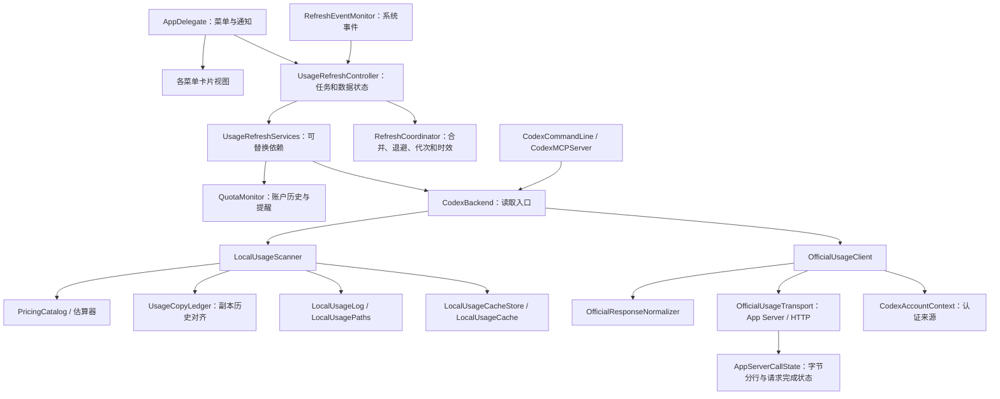

# 模块边界

项目仍使用一个 Core library 和一个 AppKit executable target。数据访问实现默认 internal；`CodexBackend` 保留 GUI、CLI、MCP 共用的公开读取入口。刷新控制器及只读状态供 AppKit 使用，不依赖 AppKit、Network 或 UserNotifications。

## 改动应放在哪里

| 改动 | 负责实现 |
| --- | --- |
| 价格、别名、费率及配置校验 | `Resources/pricing.json`、`PricingCatalog`、各价格估算器 |
| 官方认证归属、额度和重置券回退 | `CodexAccountContext`、`OfficialUsageClient` |
| 官方响应字段及格式兼容 | `OfficialResponseNormalizer` |
| 子进程或 HTTP 超时与清理 | `OfficialUsageTransport`；可执行文件发现共用 `CodexProcess` |
| app-server 输出分行、缓冲限制、响应去重及完成状态 | `AppServerCallState` |
| 日志解析、文件身份、全量和增量统计 | `LocalUsageScanner`、`LocalUsageLog`、`UsageFileIdentity` |
| 副本历史对齐、日/周来源范围及贡献归属 | `UsageCopyLedger` |
| 缓存文档、文件锁、磁盘读写 | `LocalUsageCache`、`LocalUsageCacheStore` |
| 目录选择及账户来源范围 | `LocalUsagePaths`、`CodexPaths` |
| 请求合并、退避、过期状态、结果接受规则 | `RefreshCoordinator`（`RefreshState.swift`） |
| 后台任务、取消、保留数据、账户切换及结果应用 | `UsageRefreshController`、`UsageRefreshState` |
| 数据客户端、历史处理、队列替换 | `UsageRefreshServices`、`RefreshExecuting` |
| 系统睡眠、网络变化及菜单跟踪期间的定时事件 | `RefreshEventMonitor` |
| 菜单项、状态栏、通知权限、用户偏好 | `AppDelegate`、`AppPreferences` |
| 卡片布局和绘制 | `RateLimitsMenuView`、`ResetCreditsMenuView`、`LocalUsageMenuView`、`PreferencesMenuView` |
| CLI 命令、MCP 协议、插件安装 | `CodexCommandLine`、`CodexMCPServer`、`CodexPluginInstaller` |
| 插件安装暂存、备份与回滚；插件命令超时和输出 | `PluginInstallTransaction`、`CodexPluginCommand` |

## 并发与兼容约束

控制器在 MainActor 上持有唯一的数据状态。生产执行器提供官方和本机各一条串行队列；跨队列传递 `OfficialUsageUpdate`、本机快照和请求参数等 Sendable 值。完成回调回到主队列后重新核对账户与请求代次，只有接受的结果才更新状态和发出提醒。文件身份没有变化、服务器返回的账户上下文却变化时，也会使本机旧任务失效。

`QuotaMonitor` 保存待发送状态及已确认类型；控制器在提交前检查开关、账户和窗口，并通过 `QuotaAlertRequest` 的独立编号追踪每次通知请求。AppKit 将通知中心的接收结果交回控制器，确认历史通过官方串行队列落盘。取消和迟到回调不会提前消耗提醒，发送失败与历史写入失败分别显示。兼容与重试边界见[提醒发送与确认](refresh.md#提醒发送与确认)。

`RefreshCoordinator` 是调度规则的值模型；控制器负责执行这些规则。时钟同时注入控制器和取消令牌，测试可以直接推进超时和退避。AppKit 转发系统事件，视图读取快照，不读取日志或发起请求。

扫描器继续以进程内锁串行化整个事务，文件锁覆盖读取缓存、扫描、验证账户及持久化。存储组件保留 v4 文档及原子写入方式；扫描失败或取消后，内存缓存和已读取的磁盘签名一起回滚。拆分不改变缓存路径、旧字段或基线迁移规则。

`LocalUsageCacheStore` 同时保留待保存标记和写入错误；没有数据变化时也可重试，成功后才清除。扫描快照通过独立 `persistence` 字段传递保存状态，保存失败不改变扫描完整性及有效金额。并发写入时仅合并相同基线的待保存观察，详细规则见[缓存保存与恢复](cache-persistence.md)。

CLI/MCP 继续使用独立读取快照，不继承菜单进程的刷新历史。修改边界后按[验证说明](verification.md)运行相应测试及统一检查；本次迁移顺序和结果记录在[实施计划](refactoring-plan.md)。
